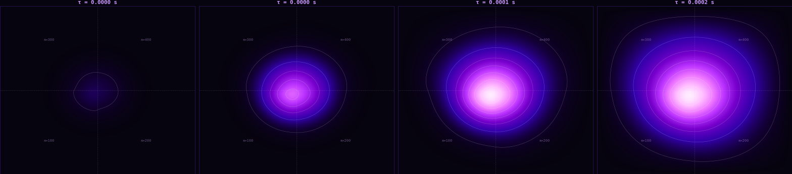

---
```bash
maria@github:~$ pwd
```
You are 127.0.0.1!
This is my personal repo. It is an inclusive, safe space where I share what I am up to: mainly project proposals, personal projects and academic stuff. 
Please, feel free to ```$ cd ../reach-out ```. Welcome! (There is no place like 127.0.0.1!)

---
```bash
maria@github:~$ whoami
```
I am María, a physics undergraduate @ UNED working at the intersection of Physics, scientific computing, HPC and everything in between (and to the sides). Always open for suggestions and happy to learn new things.

Let's see where this takes us.

---
```bash
maria@github:~$ ls
```
`background` `projects` `learning` `ask-me-about` `collabs` `reach-out` `pronouns.txt`

```bash
maria@github:~$ cat pronouns.txt
```
She/Her/Hers · They/Them/Theirs ·
Warning: I usually go by she/her. But I am fluid and use they/them sometimes. Also open to other pronouns!
Whatever feels right in our interaction, I am comfortable with! Share yours too if you'd like :)

```bash
maria@github:~$ cd background
```
`geology-olympiads` `astrophysics-internship` `ALBA-Hackathon-2025` `MNHACK25-BSC` `UNED` `CCAR` `3D-STLPROJECT` `PUMPS+AI-26` `iCSC26`

```bash
maria@github:~/background$ cd geology-olympiads
maria@github:~/background/geology-olympiads$ ls -la
```
total 3
|---------|--------|--------|--------|
| Murcia Regional Geology Olympiad | 2017 | 3rd place | Assisted National Phase in Salamanca (Spain) |
| Murcia Regional Geology Olympiad | 2018 | 2nd place | Assisted National Phase in Segovia (Spain) |
| Murcia Regional Geology Olympiad | 2019 | 3rd place | Schedule conflict. Didn't attend national phase |

```bash
maria@github:~/background$ cd ../../astrophysics-internship
maria@github:~/background/astrophysics-internship$ ls
```

```bash
maria@github:~/background$ cd ../ALBA-Hackathon-2025
```
```bash
maria@github:~/background$ cd ../MNHACK25-BSC
```
```bash
maria@github:~/background$ cd ../UNED
```
```bash
maria@github:~/background$ cd ../CCAR
```
```bash
maria@github:~/background$ cd ../3D-STLPROJECT
```
```bash
maria@github:~/background$ cd ../PUMPS+AI-26
```
```bash
maria@github:~/background$ cd ../iCSC26
```


---
```bash
$ cd ../projects
$ ls -la /projects
```
I am currently working on:
| project | description | status | institution/event |
|---------|--------|--------|--------|
| `fem-heat-solver-mn5` |Assembly-free GPU FEM for heat dissipation in an heterogeneous media. | Done. Documenting project | BSC - MNHACK25|
| `pumps-ai-wave-pinn` | CUDA wave propagation + PINN. Seismic Waves| Done. Documenting project | PUMPS + AI 26 · Poster Proposal |
| `newtonian-limit` | Study of the newtonian limit of the Schrödinger equation. | Redacting LaTeX doc. | Research task assigned by a former professor. |
|`nevus-tori`| Computational approach to pathologic anatomy on acral tissue with severe displasia. | Ongoing. | Personal |
| `physics-notebook` | Study notes and derivations | Ongoing | Personal |

*most repos private while in progress — request access or check back*

---
```bash
ls -
```
<!--
**mariagarciapenalva/mariagarciapenalva** is a ✨ _special_ ✨ repository because its `README.md` (this file) appears on your GitHub profile.

Here are some ideas to get you started:

- 🔭 I’m currently working on ...
- 🌱 I’m currently learning ...
- 👯 I’m looking to collaborate on ...
- 🤔 I’m looking for help with ...
- 💬 Ask me about ...
- 📫 How to reach me: ...
- 😄 Pronouns: ...
- ⚡ Fun fact: ...
-->
